#  E-Commerce Microservices Application

Bu proje, **NestJS** kullanılarak geliştirilen, modüler, ölçeklenebilir ve event-driven mimariye sahip bir e-ticaret sistemidir.
---

##  Proje Mimarisi

Sistem, her biri belirli bir işlevi üstlenen bağımsız mikroservislerden oluşur:

- **API Gateway:** HTTP isteklerini alır ve ilgili mikroservislere yönlendirir.
- **Users Microservice:** Kullanıcı CRUD işlemleri ve rol bazlı erişim.
- **Auth Microservice:** JWT tabanlı kimlik doğrulama ve yetkilendirme.
- **Products Microservice:** Ürün CRUD, arama, sıralama, cache, elasticsearch.
- **Orders Microservice:** Sipariş işlemleri, Kafka ile event yayını.
- **Cart Microservice:** Kullanıcı sepet yönetimi (MongoDB).
- **Notifications Microservice:** Sipariş sonrası e-posta bildirimi.
- **Shipping Microservice:** Sipariş sonrası kargo süreci.
- **Stock Microservice:** Sipariş sonrası stok güncelleme.
- **Shared Library:** Ortak DTO, enum, interface ve yardımcı fonksiyonlar.

---

##  Kullanılan Teknolojiler

- **NestJS** – Mikroservis çatısı
- **PostgreSQL**, **SQLite**, **TypeORM** – Veritabanı ve ORM
- **MongoDB**, **Mongoose** – NoSQL veritabanı
- **Redis** – Cache ve Rate Limiting
- **ElasticSearch** – Ürün arama işlemleri
- **JWT** – Kimlik doğrulama
- **Apache Kafka** – Event-driven mesajlaşma
- **Docker & Docker Compose** – Container yönetimi

---

##  Proje Yapısı

```bash
ecommerce-app/
├── api-gateway/                 # HTTP giriş noktası (port: 3000)
├── auth-microservice/           # JWT auth (port: 3021)
├── cart-microservice/           # MongoDB sepet servisi (port: 3024)
├── notifications-microservice/  # Kafka consumer - e-posta (port: 3026)
├── orders-microservice/         # Sipariş + Kafka publisher (port: 3023)
├── products-microservice/       # PostgreSQL ürün CRUD (port: 3022)
├── shipping-microservice/       # Kafka consumer - kargo yönetimi (port: 3027)
├── stock-microservice/          # Kafka consumer - stok güncelleme (port: 3028)
├── users-microservice/          # PostgreSQL kullanıcı servisi (port: 3020)
├── libs/                        # Ortak tip, DTO, enum
├── docker-compose.yml           # Tüm sistemin orkestrasyonu
└── .env                         # Ortak environment değişkenleri
```

---

##  Başlatma

> Gereksinimler: Docker ve Docker Compose

```bash
cp .env.example .env
docker compose up --build
```

Servis durumu kontrolü:

```bash
docker compose ps
```

Durumlandırmak için:

```bash
docker compose down
```

---

##  Kimlik Doğrulama

- Tüm auth işlemleri `auth-microservice` üzerinden yürütülür.
- API Gateway katmanında:
  - `JwtAuthGuard`, `RolesGuard`, `OwnerGuard`, `owner-of-product`, `owner-of-order` gibi guardlar uygulanır.
- Roller:
  - `USER`, `ADMIN`, `SUPER_ADMIN`, `SELLER`

---

##  Mikroservisler ve Roller

### API Gateway (Port: 3000)
- HTTP isteklerini alır ve mikroservislere yönlendirir
- JWT tabanlı kimlik doğrulama
- Global interceptor ile standart response yapısı
- Global exception filter ile merkezi hata yönetimi
- Redis tabanlı önbellekleme (cache)
- Elasticsearch için ProductSearchController ve ProductSearchService
- Mikroservislerle TCP üzerinden haberleşme
- RpcException handling ile sağlam hata yönetimi
- DTO transformasyon ve request validation


### Users Microservice (Port: 3020)
- PostgreSQL ile kullanıcı yönetimi
- CRUD işlemleri
- Rol bazlı erişim kontrolü (`UserRole` enum)

### Auth Microservice (Port: 3021)
- JWT üretimi, doğrulama, kullanıcı profil bilgisi (`me`)
- TCP üzerinden `users-microservice` ile haberleşme

### Products Microservice (Port: 3022)
- Ürün CRUD
- Arama, sıralama, pagination
- Stok azaltma, seller bazlı listeleme
- Redis ile ürün detayı ve liste cache işlemleri
- Elasticsearch için ElasticsearchSyncService ve /products/sync-to-elastic endpointi

### Orders Microservice (Port: 3023)
- Sipariş oluşturma, güncelleme, listeleme, kullanıcı bazlı siparişleri
- Kafka ile `ORDER_CREATED` eventi yayınlama
- Siparişin ürün ve toplam tutar ilişkisini yönetme

### Cart Microservice (Port: 3024)
- MongoDB ile kullanıcı bazlı sepet yönetimi
- TCP üzerinden `products` ile haberleşme
- JWT korumalı sepet işlemleri (ekle, sil, listele)

### Notifications Microservice (Port: 3026)
- Kafka’dan `ORDER_CREATED` eventi dinlenir
- Nodemailer ile e-posta gönderimi

### Shipping Microservice (Port: 3027)
- Kafka’dan sipariş eventi alınır
- Dummy kargo kaydı oluşturulur
- Kafka ile `ORDER_SHIPPING_CREATED` eventi yayınlanır
- Siparişin kargo durumu takibi yapılır

### Stock Microservice (Port: 3028)
- Kafka’dan sipariş bilgisi alınır
- Ürün stok bilgileri `products-microservice` üzerinden güncellenir
- Kritik stok seviyelerinde loglama yapılır

---

##  Ekran Görüntüleri

### Genel Görünüm
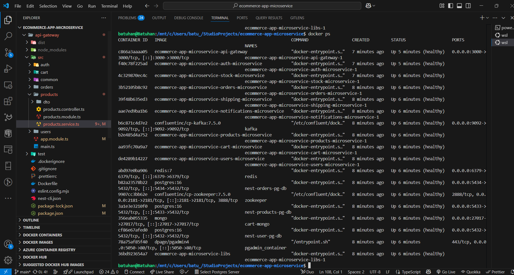

### Genel Görünüm - 2 (ram sıkıntısından dolayı gerekli containerlerın çalışmış hali)
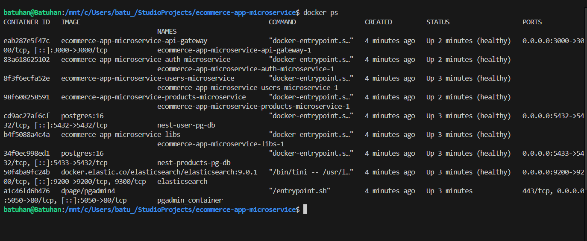

### API Gateway
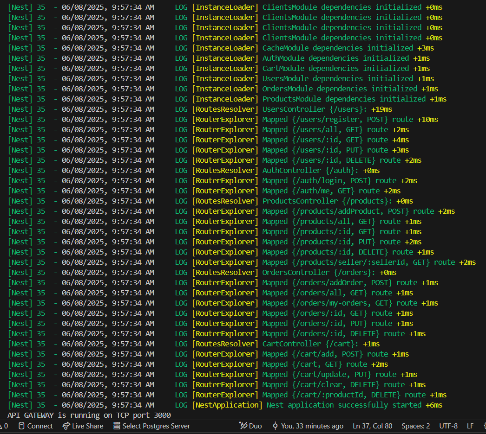

### Auth Microservice
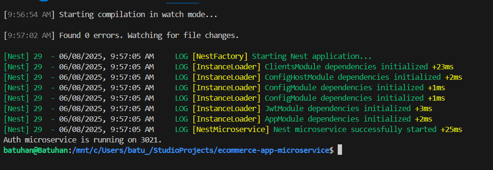

### Cart Microservice
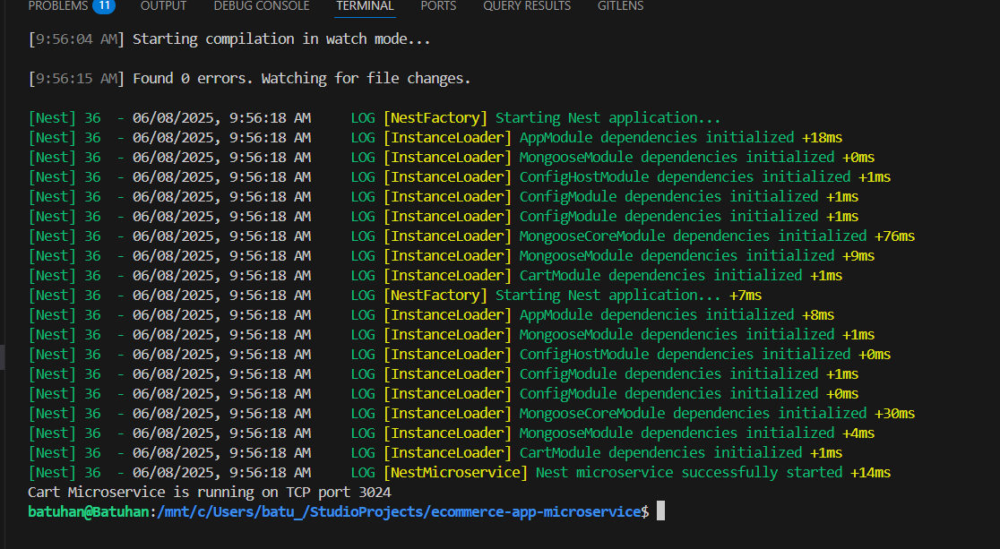

### Kafka Yapısı
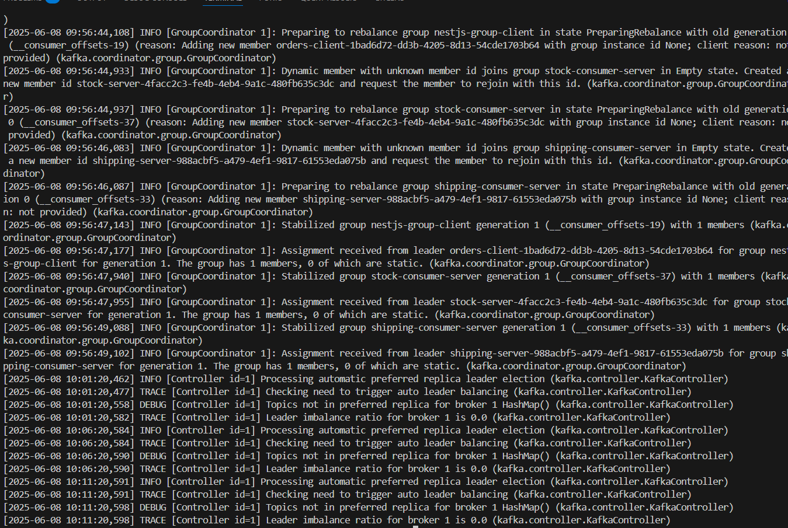

### Orders Microservice
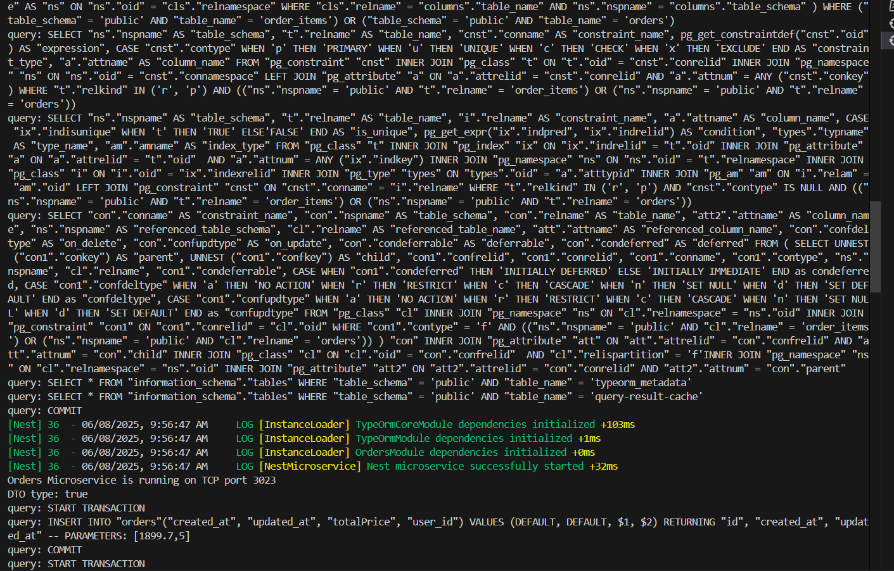

### PG
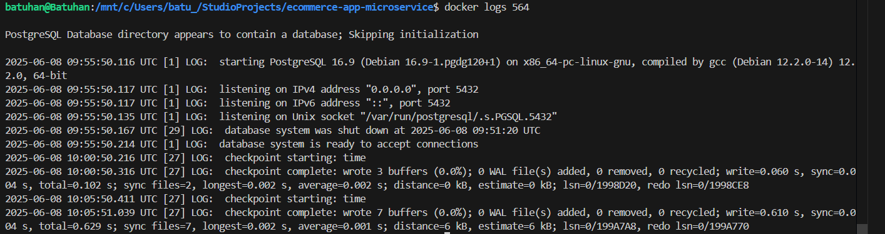

### Products Microservice
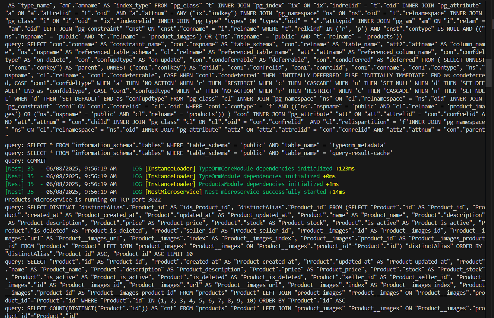

### Shipping Microservice
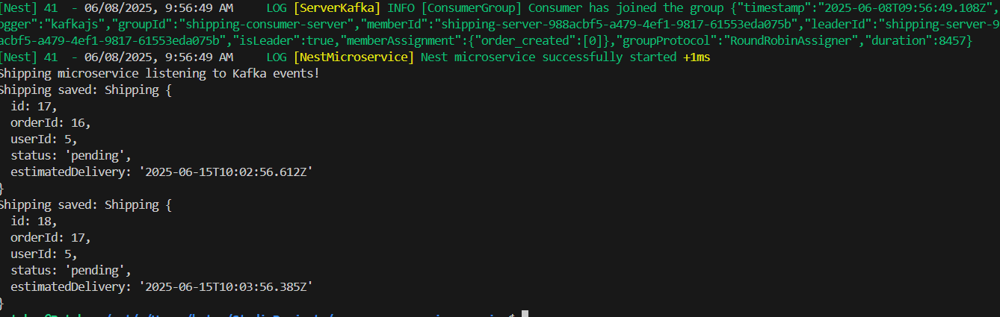

### Stock Microservice
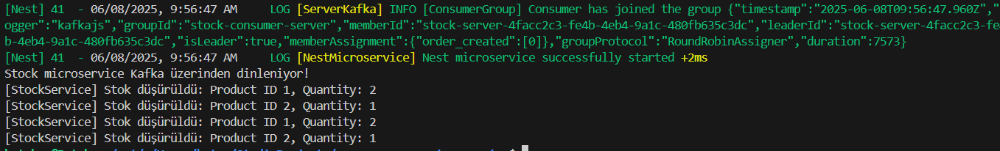

### Users Microservice
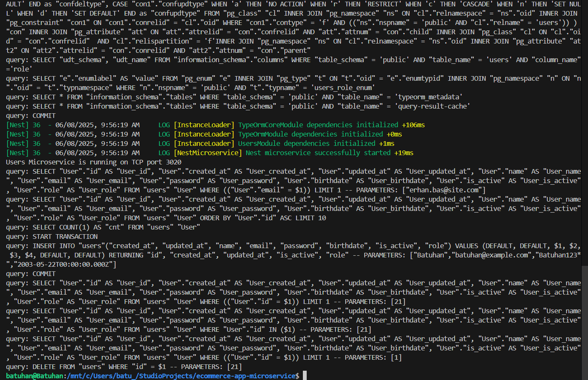

### ZooKeeper
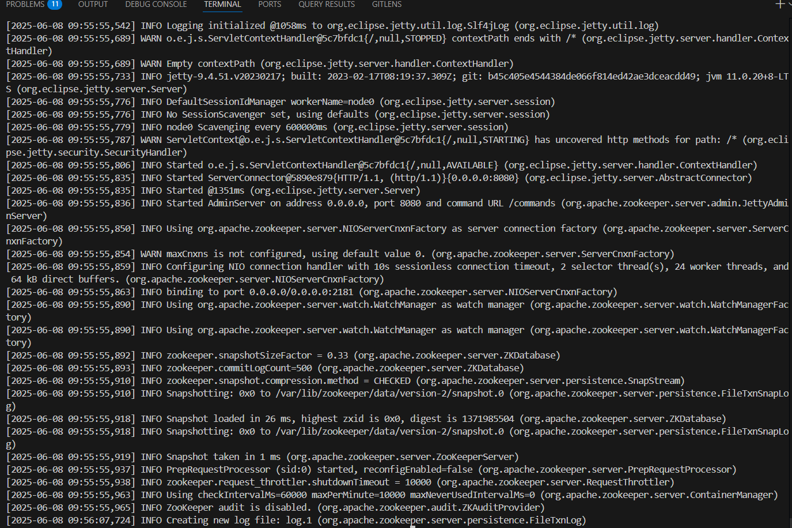

### ElasticSearch
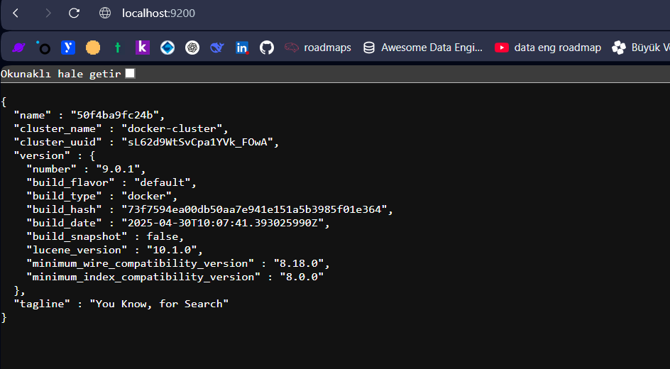


---

##  Ortak Kütüphane (libs/)

- Ortak tip, DTO, enum, event constant, helper fonksiyonları içerir
- `@ecommerce/types` olarak servislerde import edilir
- Her servis, `file:../libs` şeklinde bağımlı tanımlanmıştır

---
